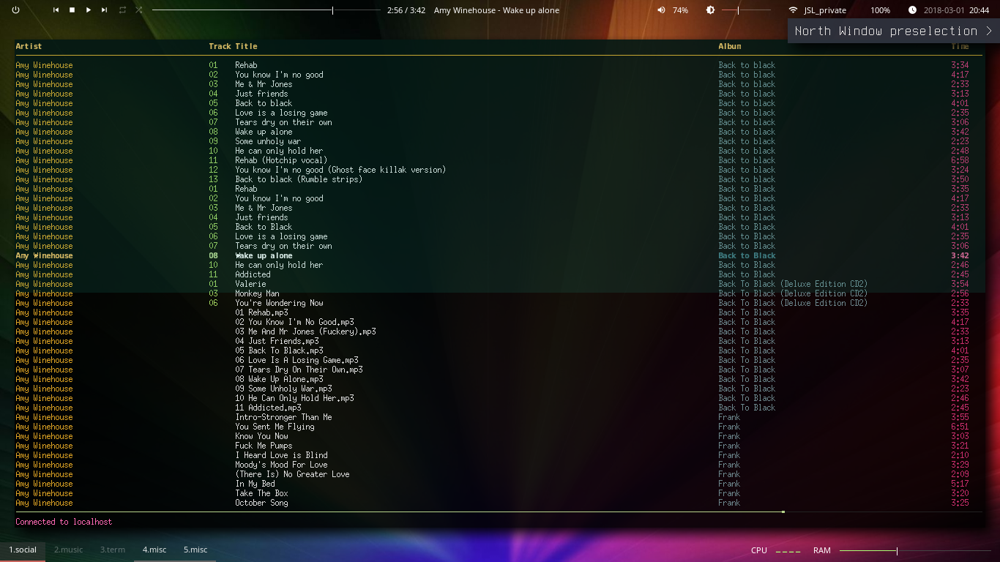
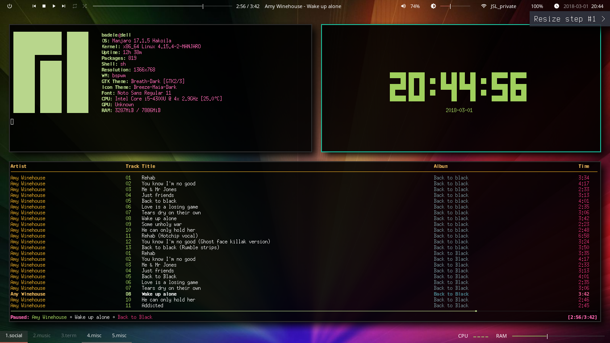

| Col1  | Col2 | Col3 |
| ----- | ---- | ---- |
| Initial |  |   |
| east presel | bspc node -p east |   |
| Launch tty-clock | /usr/bin/urxvt -e sh -c tty-clock |   |
| Resize step #1 | bspwm_resize.sh north 50 |   |
| Resize step #2 | bspwm_resize.sh north 50 |   |
| Resize step #3 | bspwm_resize.sh north 50 |   |
